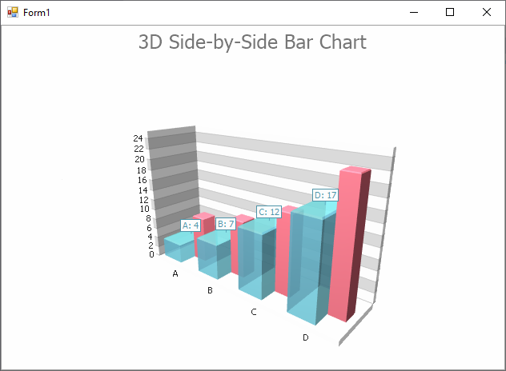

<!-- default badges list -->

<!-- default badges end -->

# Chart for WinForms - How to create a 3D Side-by-Side Bar chart

The following example demonstrates how to create a [3D Side-by-Side Bar](https://docs.devexpress.com/WindowsForms/3421/controls-and-libraries/chart-control/series-views/3d-series-views/bar-series-views/side-by-side-bar-chart?p=netframework) chart at runtime.

The `Bar3DSeriesView` series view type is associated with the [XY-Diagram 3D](https://docs.devexpress.com/WindowsForms/5909/controls-and-libraries/chart-control/diagram/xy-diagram-3d?p=netframework) type. Cast your [diagram](https://docs.devexpress.com/WindowsForms/5778/controls-and-libraries/chart-control/diagram?p=netframework) object to the `Bar3DSeriesView` type to access its specific options.

## Files to Review

[Form1.cs](./CS/Series_3DBarChart/Form1.cs) (VB: [Form1.vb](./VB/Series_3DBarChart/Form1.vb))

## Documentation 

[Side-by-Side Bar Chart](https://docs.devexpress.com/WindowsForms/3421/controls-and-libraries/chart-control/series-views/3d-series-views/bar-series-views/side-by-side-bar-chart)
